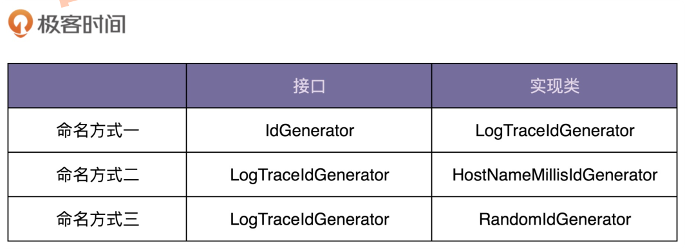

# 接口鉴权系统

## 需求分析

### 初版
1. 通过类实现，而不是接口
2. 静态函数，而且依赖于运行环境（本机名）、时间函数、随机函数，可测试性不好，也没有对于单元测试
3. 未处理 hostname 为空的情况
4. 异常处理直接捕获吞掉，没有上抛
5. 不涉及共享变量，线程安全
6. 每次都要获取 hostname，影响性能
7. randomAscii 的范围是 0～122，但可用数字仅包含三段子区间（0~9，a~z，A~Z），极端情况下会随机生成很多三段区间之外的无效数字
8. 三个 if 逻辑相似，可以合并
9. 魔法数使用过多，可读性不好

要循序渐进、**小步快跑**。重构代码的过程也应该遵循这样的思路。每次改动一点点，改好之后，再进行下一轮的优化，保证每次对代码
的改动不会过大，能在很短的时间内完成。

第一轮重构：提高代码的可读性
第二轮重构：提高代码的可测试性
第三轮重构：编写完善的单元测试
第四轮重构：所有重构完成之后添加注释

### 优化版

LogTraceIdGenerator 命名过于通用，新的实现类就不好取名，无法取到跟 LogTraceIdGenerator 平行的名字了。
而且不同的业务，不存在互相替换的场景，让 LogTraceIdGenerator、UserIdGenerator、OrderIdGenerator 三个实现同一接口没有意义。

HostNameMillisIdGenerator 太过详细，实现类暴露了太多实现细节，只要代码稍微有所改动，就可能需要改动命名，才能匹配实现。

在目前的 ID 生成器代码实现中，我们生成的 ID 是一个随机 ID，不是递增有序的，RandomIdGenerator 是比较合理的，即便内部
生成算法有所改动，只要生成的还是随机的 ID，就不需要改动命名。
如果我们需要扩展新的 ID 生成算法，比如要实现一个递增有序的 ID 生成算法，那我们可以命名为
SequenceIdGenerator。

更好的一种命名方式是，我们抽象出两个接口，一个是 IdGenerator，一个是 LogTraceIdGenerator，LogTraceIdGenerator 继承 IdGenerator。
实现类实现接口 IdGenerator，命名为 RandomIdGenerator、SequenceIdGenerator 等。这样，实现类可以**复用**到多个业务模块中，
比如前面提到的用户、订单。

### 再优化版

### 最终版

### 需求总结

## 类定义

### AuthToken

### Url

### CredentialStorage 

## 入口

## 总结

1. 划分职责进而识别出有哪些类
2. 定义类及其属性和方法
3. 定义类与类之间的交互关系
4. 将类组装起来并提供执行入口